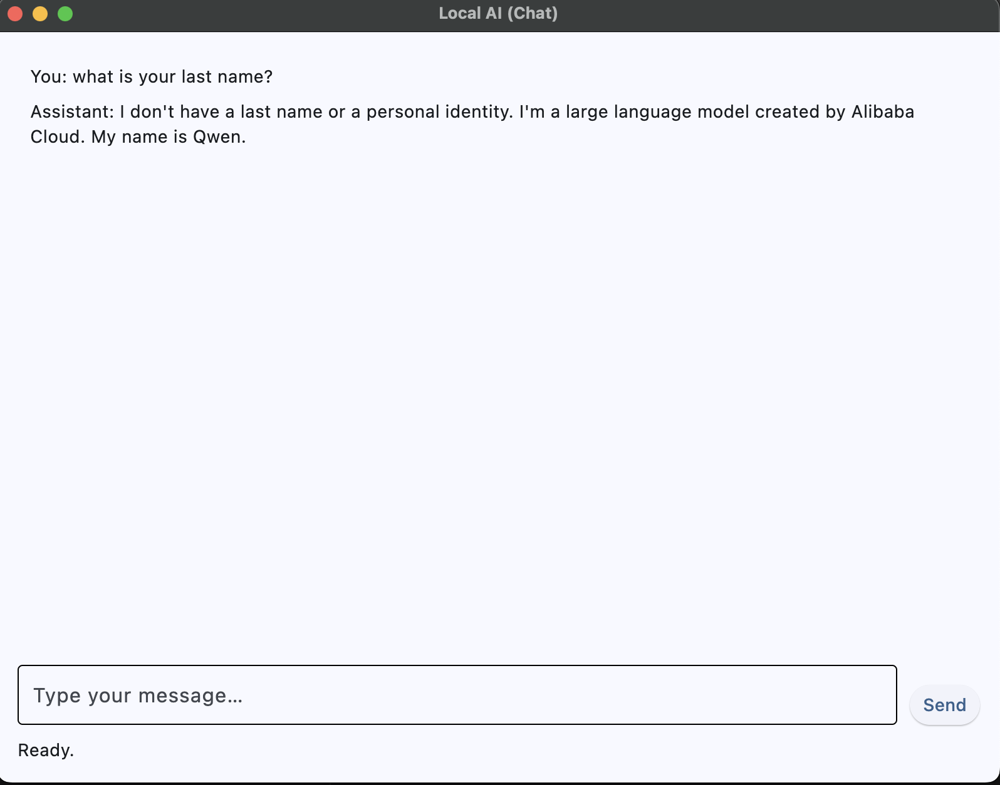

# Local AI

Local AI is a minimal desktop chat application that lets you run small language models completely offline. It uses [Flet](https://flet.dev/) for the user interface and [llama-cpp-python](https://github.com/abetlen/llama-cpp-python) for model inference. The goal of the project is to provide a simple starting point for experimenting with local models without relying on any external APIs.



## Features

- Cross‑platform graphical interface built with Flet.
- Loads [GGUF](https://github.com/ggerganov/ggml/blob/master/docs/gguf.md) models through `llama-cpp-python`.
- Streams model output token by token for a responsive chat experience.
- Configurable asset directory and model location.
- Tested using `pytest` with a lightweight fake model for fast feedback.

## Using this template

To start a new project from this repository:

1. Click **Use this template** on GitHub and choose **Create a new repository**.
2. Rename the project:
   - Update the repository name on GitHub.
   - Replace references to "Local AI" in `README.md` and module names if needed.
3. Update project metadata:
   - Edit `pyproject.toml` with your package name, description, and author details.
   - Adjust the license and other documentation to match your project.
4. Customize the code:
   - Modify modules under `src/` and tests in `tests/` to fit your requirements.
   - Adjust dependencies in `pyproject.toml` as required.

## Project Layout

```text
src/
  app.py             # Flet application entry point
  core/llm_adapter.py# Wrapper around llama-cpp-python
  ui/chat.py         # Chat view and interaction logic
  paths.py           # Resolves asset and output directories
  assets/            # (not tracked) place models and other resources here
```

## Getting Started

### 1. Install Python

Ensure you have **Python 3.9 or newer** available on your system.

### 2. Create a virtual environment

You can use any tool you like. Using `python -m venv`:

```bash
python -m venv .venv
source .venv/bin/activate  # On Windows use `.venv\Scripts\activate`
```

### 3. Install dependencies

Install runtime and development dependencies. The project uses [`uv`](https://github.com/astral-sh/uv) but regular `pip` works as well.

Using `pip`:

```bash
pip install -r <(python - <<'PY'
import toml
print('\n'.join(toml.load('pyproject.toml')['project']['dependencies']))
PY
)
pip install flet[all]==0.28.3 ruff black pytest
```

Or with `uv`:

```bash
uv sync
```

### 4. Provide a model

Place at least one GGUF model file under `src/assets/models/llm/`. On startup the app
loads the first `.gguf` file it finds. To point to a specific file use the
`LOCALAI_MODEL` environment variable or the `--model` command‑line option:

```
LOCALAI_MODEL=/path/to/model.gguf make run
# or
python src/app.py --model /path/to/model.gguf
```

If you want to store assets elsewhere, set `LOCALAI_ASSETS_DIR` to a directory that
contains `models/llm`. The `paths.py` module will pick it up automatically.

### 5. Run the app

```bash
make run
```

The window will open with a transcript view and a single input box. On first
send the model loads from disk and the response streams back into the chat.

## Development

Run formatting, linting and tests before committing:

```bash
ruff format .
ruff check .
pytest
```

These commands are also wrapped in the `Makefile`:

```bash
make fmt     # format
make lint    # lint only
make test    # run tests
```

## Packaging

The repository contains a small `Makefile` that bundles the application with
[PyInstaller](https://pyinstaller.org). From an activated virtual environment
run:

```bash
make pyi
```

The resulting application bundle will appear under `dist/`.

## Troubleshooting

- **Missing model:** The chat view searches for a GGUF file under `models/llm`. If none is
  found, or the path given via `LOCALAI_MODEL`/`--model` is missing, you will see a
  notification.
- **GPU issues:** When packaging with PyInstaller the runner forces CPU mode by
  default to avoid Metal/OpenCL initialization failures.

## Contributing

Pull requests and issues are welcome. See [CONTRIBUTING.md](CONTRIBUTING.md) for setup details,
coding standards, and the pull request process. By participating, you agree to abide by our
[Code of Conduct](CODE_OF_CONDUCT.md).

## License

This project is licensed under the [MIT License](LICENSE).

